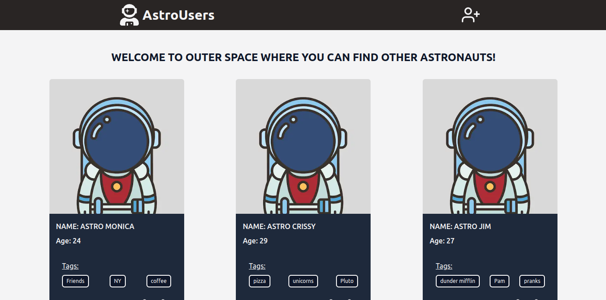
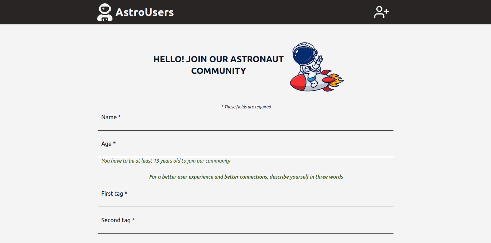
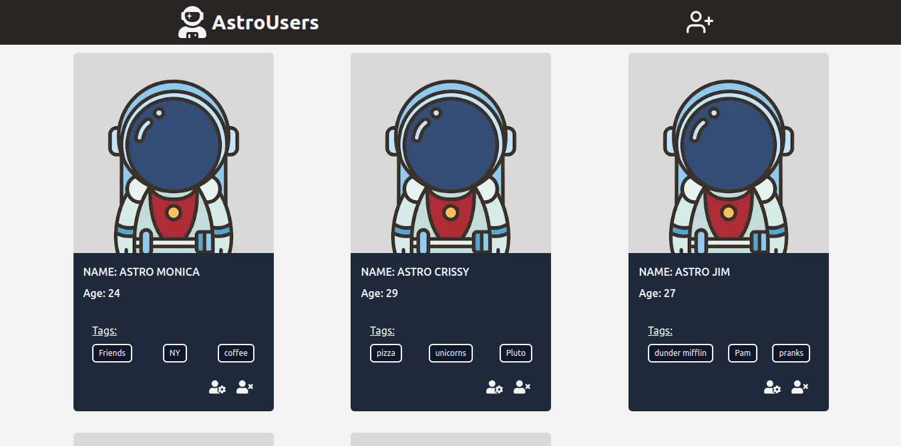
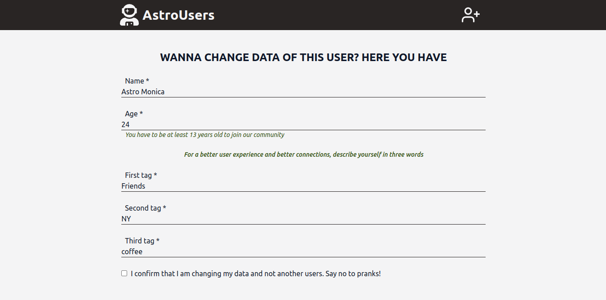
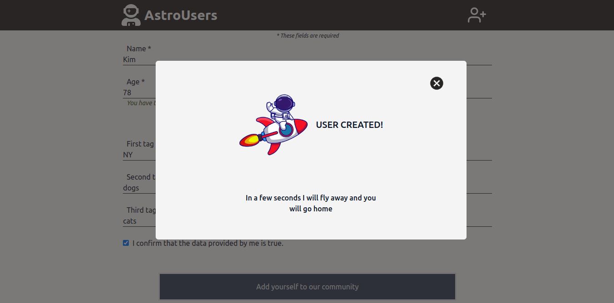

# 🚀 AstroUsers

### Description

AstroUsers - the outer space community which connecting astronauts from around the world and space. App created with using Next.JS, Tailwind, Mongoose and React Hook Form. It's of course responsive for all devices (also Galaxy Fold 😉).

The project constist of:
- main view displaying all the AstroUsers,
- single card of AstroUser with default photo, name, age, tags & functionality of editing and deleting user from database,
- with the possibility of changing the user's data, the form displays data fetched from the database for a specific user,
- after adding, editing or deleting user the concrete popup is shown,
- this popup also displays errors returned when validating the form.

### Preview

###### Home page

###### View of form to add user

###### View of single user card

###### View of form to change user's data

###### View of popup after adding new user

